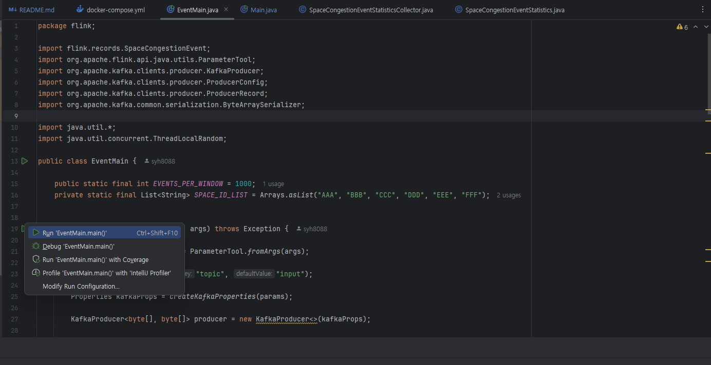
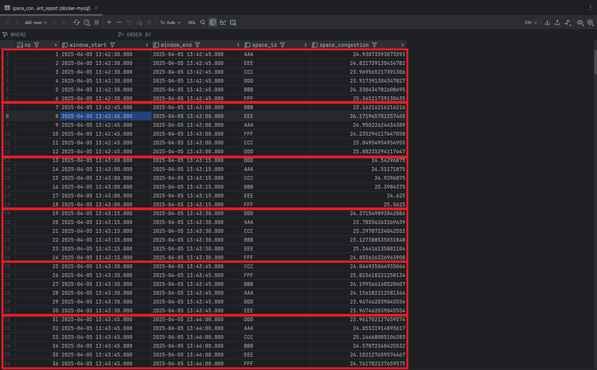

# Flink 이용해서 실시간 데이터 스트림 처리 해보기 - 실시간 CCTV 혼잡도 구하기

## 로컬 환경 실행 방법

### Skill & Tools - Backend
- Flink 1.16.3
- Java 11
- Mysql 8.x
- docker
- zookeeper
- kafka
- kafka-ui

### Service Endpoint

- flink-service
    - http://localhost:8081

- Mysql
    - http://localhost:3306
    - id: root
    - password: 1234

- kafka
    - http://localhost:9092,http://localhost:9093,http://localhost:9094

- kafka-ui
    - http://localhost:8989

#### 로컬에서 Flink 설치 및 Flink Cluster 실행 하기
https://archive.apache.org/dist/flink/flink-1.16.3/

여기서는 Flink 1.16.3 버전을 사용 합니다. 해당 링크를 접속해서 `flink-1.16.3-bin-scala_2.12.tgz` 선택해 다운로드 합니다.

##### Max OS 설치 방법
Max OS 를 사용하는 사용자는 압축 해제 한 다음에 

```markdown
cd ./flink-1.16.3/bin
```

접근 하도록 합니다. 

```markdown
./start-cluster.sh 
```

해당 명령어를 실행하면 Flink cluster 를 실행 하게 됩니다. 그런 후 http://localhost:8081 로 접근 합니다. 

##### Window OS 설치 방법
윈도우 OS 사용자는 별로로 `WSL` 이용해서 리눅스 환경 안에 Flink 를 설치 해야 합니다.

https://learn.microsoft.com/ko-kr/windows/wsl/install (WSL을 사용하여 Windows에 Linux를 설치하는 방법)

Linux 설치가 완료되면 Linux 환경에 접근 해서 

```markdown
wget https://archive.apache.org/dist/flink/flink-1.16.3/flink-1.16.3-bin-scala_2.12.tgz
```

해당 명령어를 통해 flink 1.16.3 버전으로 다운로드 합니다.

```markdown
tar -xvf ./flink-1.16.3-bin-scala_2.12
```
명령어를 이용해서 압축 해제를 합니다.

압축 해제를 완료했으면 

```markdown
cd ./flink-1.16.3/bin
```

접근 해서 

```markdown
./start-cluster.sh 
```

flink cluster 를 실행 하도록 합니다. 그런 후 http://localhost:8081 로 접근 합니다.

#### Flink Cluster 종료하기
```markdown
cd ${flink 설치 경로}/flink-1.16.3/bin
```
flink 설치한 bin 디렉토리에 이동 하셔서

```markdown
./stop-cluster.sh
```

실행 하면 정상적으로 flink cluster 를 종료 하게 됩니다.

#### 필요한 connector 다운로드
Flink 통해 분석한 데이터를 Mysql 로 `Sink` 하게 될텐데요. 이를 위해서 필요한 jdbc 관련 jar 를 설치 해야 합니다.
```markdown
// download url
https://repo.maven.apache.org/maven2/org/apache/flink/flink-connector-jdbc/1.16.3/flink-connector-jdbc-1.16.3.jar
https://repo.maven.apache.org/maven2/mysql/mysql-connector-java/8.0.19/mysql-connector-java-8.0.19.jar
```
해당 링크를 통해 필요한 jdbc jar 파일을 다운 로드 하고

```markdown
cd ${flink 설치 경로}/flink-1.16.3/lib
```

lib 에 이동하셔서 다운로드한 파일을 복사 및 붙여넣기 하도록 합니다.


#### Flink Job Execution
```
// 1. 해당 프로젝트 루트 디렉토리 까지 이동 합니다. 
cd ${프로젝트 디렉토리}

// 2. `jar` 실행파일을 생성 합니다.
./gradlew bootJar

// 3. 생성한 jar 파일을 이전에 설치한 flink 디렉토리에 이동 합니다.

// 4. docker-compose 를 실행 합니다.
docker-compose up -d

// 5. 
cd ${flink 설치한 디렉토리}/bin
./start-cluster.sh // flink 프로세스 실행
./flink run -d /${생성 jar 파일 경로}/${jar 생성한 파일명}.jar --bootstrap.servers localhost:9094 --checkpointing --event-time
ex> ./flink run -d /home/syh8088/flink_space_congestion.jar --bootstrap.servers localhost:9094 --checkpointing --event-time
```
`flink cluster` 를 실행하고 만들었던 jar 파일을 이용해서 Job 을 실행 하면 됩니다. 


#### 임의 CCTV Event Server 실행 방법


`EventMain` 클래스 접근 해서 실행하면 됩니다.

#### Flink 이용해서 실시간 데이터 스트림 처리 해보기 - 실시간 CCTV 혼잡도 구하기 결과 (Mysql DB 서버 적재)


`space_congestion` 스키마에서 `space_congestion_event_report` 테이블을 확인 합니다. 
